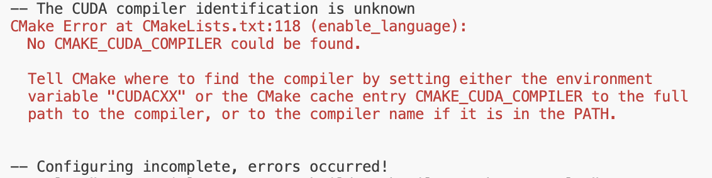
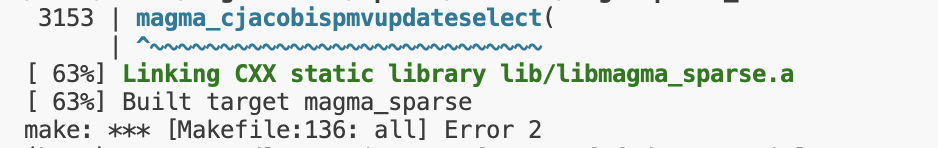
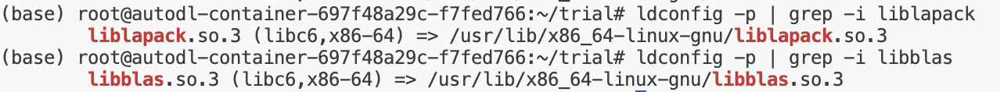

1. **Download**
    Download the source code from the [Magma website](httpss://icl.utk.edu/magma/) (this guide uses Magma 2.9.0 as an example). Do **not** clone it from the GitHub repository.
    ```bash
    wget https://icl.utk.edu/projectsfiles/magma/downloads/magma-2.9.0.tar.gz
    tar -xvzf magma-2.9.0.tar.gz
    cd magma-2.9.0
    ```

2. **Create Build Directory**
    Create a `build` directory for the compilation process.
    ```bash
    mkdir build && cd build
    ```

3. **Configure with CMake**
    Note: Replace name after `-DGPU_TARGET` in the following command according to your device. In this example, the GPU is an NVIDIA H20, so the target is `"Hopper"`. For other options, see the [GitHub README](httpss://github.com/icl-utk-edu/magma).
    ```bash
    export CUDADIR=/usr/local/cuda
    cmake .. -DMAGMA_ENABLE_CUDA=ON -DGPU_TARGET="Hopper" -DBUILD_SHARED_LIBS=off -DUSE_FORTRAN=off
    ```

    - **Troubleshooting: CUDA Compiler Not Found**
        If you haven't specified your CUDA compiler, CMake might fail with an error message like this:
        
        
        To fix this, first locate the CUDA compiler:
        ```bash
        find /usr -name nvcc 2>/dev/null
        ```
        If the output is, for example:
        ```bash
        /usr/local/cuda-12.8/bin/nvcc
        ```
        Then, add the compiler and its associated libraries to your environment variables:
        ```bash
        export PATH=/usr/local/cuda-12.8/bin:$PATH
        export LD_LIBRARY_PATH=/usr/local/cuda-12.8/lib64:$LD_LIBRARY_PATH
        ```
        After setting the paths, clean everything in the `build` folder and run the CMake command again.

4. **Compile**
    ```bash
    make -j"$(nproc)"
    ```
    - **Troubleshooting: BLAS/LAPACK Not Found**
        The compilation will terminate if CMake cannot locate your BLAS/LAPACK libraries, showing an error like this:
        

        To resolve this, find the paths to your BLAS/LAPACK libraries:
        ```bash
        ldconfig -p | grep -i liblapack
        ldconfig -p | grep -i libblas
        ```
        An example output might look like this:
        
      
        Then, clean everything in the `build` folder and return to step 3. This time, include the paths to the libraries in the CMake command:
        ```bash
        cmake .. -DLAPACK_LIBRARIES="/usr/lib/x86_64-linux-gnu/liblapack.so.3;/usr/lib/x86_64-linux-gnu/libblas.so.3" -DMAGMA_ENABLE_CUDA=ON -DGPU_TARGET="Hopper" -DBUILD_SHARED_LIBS=off -DUSE_FORTRAN=off
        ```
        Note: Replace the paths after `-DLAPACK_LIBRARIES=` with the correct locations of your BLAS and LAPACK libraries.

5. **Install**
    
    ```bash
    make install
    ```